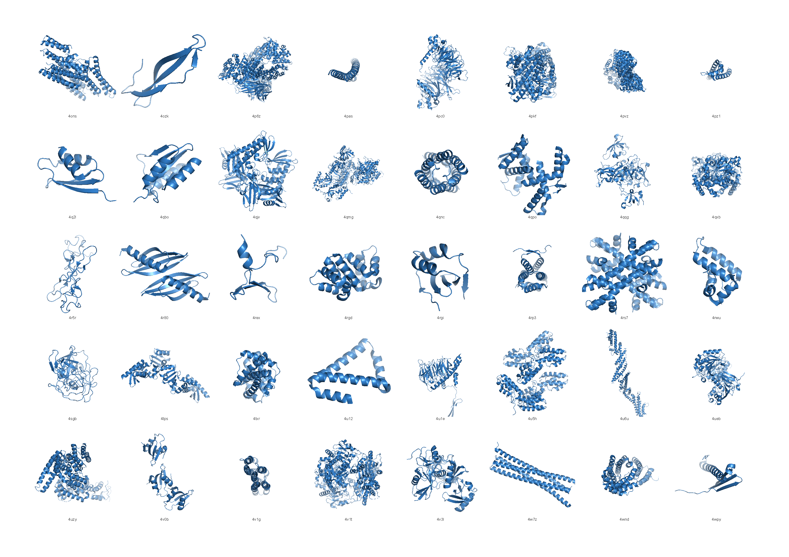

# PyMolGridVisualiser



PyMolGridVisualiser is a Python tool designed to generate PDF visualizations of PDB files in a grid layout. Utilizing PyMOL, this tool makes it easier to visualise multiple protein structures at once.

## Table of Contents

- [Installation](docs/installation.md)
- [Usage](docs/usage.md)
- [FAQ](docs/faq.md)

## How It Works
- Searches the provided directory and its all subdirectories to find all .pdb files. 
- Selects num_files worth of pdbs at random and generates an image for it via pymol API.
- Puts the images to a PDF document.

## Quick Start

To quickly get started with PyMolGridVisualiser:

1. Clone this repository:
    ```
    git clone https://github.com/profdocpizza/PyMolGridVisualiser.git
    ```

2. Navigate to the PyMolGridVisualiser directory:
    ```
    cd PyMolGridVisualiser
    ```

3. Install the required packages using Anaconda:
    ```
    conda env create -f environment.yml
    ```

4. Activate the environment:
    ```
    conda activate pymolgrid
    ```

5. Unzip example pdb files:
    ```
    unzip examples/pdbs/all_pdbs.zip -d examples/pdbs/
    ```

6. Run the tool on sample PDB files:
    ```
    python src/protein_visualiser.py examples/
    ```
7. The output file will be saved in `/outputs` directory as PDF.

8. Run the tool on your PDB files with custom settings:
    ```
    python src/protein_visualiser.py path/to/your/pdbs --filename_pattern "" --num_files 1000 --grid 8 5 --output_pdf_name "proteases"
    ```
    
For detailed usage instructions, visit the [Usage Guide](docs/usage.md).
